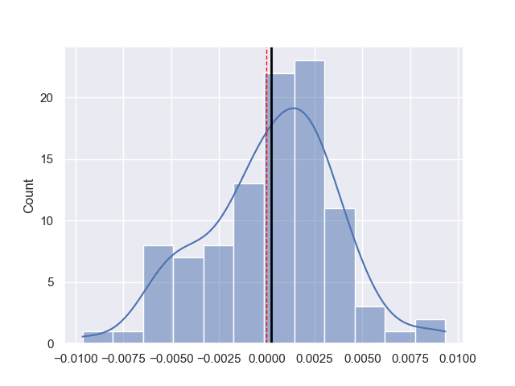

# Bootstrapped ANOVA
Goal is to implement a more flexible ANOVA (bootstrapped version).

## Conclusion
Results suggest that the bootstrapped ANOVA is a suitable and more flexible alternative to the one-way ANOVA for determining whether there are any statistically significant differences between the samples means. The p-values obtained using the bootstrapped ANOVA are comparable to those obtained using the one-way ANOVA : results are showing high p-values correlation between the 2 methods and no biais.

## Method
First a custom F statistic is computed on the original data. Then we compute it multiple times on generated data coming from random resampling (with replacement). The p value is then computed on that distribution of bootstrapped F statistics.

$$F = \frac{\text{Variance between sample's means}}{\text{Variance within samples}} \propto \frac{\text{SS(between)}}{\text{SS(within)}} = \frac{\text{SS(between)}}{\text{SS(total) - SS(between)}}$$

### Demonstration
$$\text{SS(within)} = \sum_{i=1}^m \sum_{j=1}^{n_i} (X_{ij} - \bar X_{i})^2$$

$$\text{SS(between)} = \sum_{i=1}^m \sum_{j=1}^{n_i} (\bar X_{i} - \bar X)^2$$

$$\text{SS(total)} = \sum_{i=1}^m \sum_{j=1}^{n_i} (X_{ij} - \bar X)^2$$

Where m is the number of groups we compare, ${n_i}$ the number of samples in group i, $\bar X_{i}$ the group i mean and $\bar X$ all samples mean. Therefore :
$$\text{SS(total)} = \sum_{i=1}^m \sum_{j=1}^{n_i} ((X_{ij} - \bar X_{i}) + (\bar X_{i} - \bar X))^2$$
$$= \sum_{i=1}^m \sum_{j=1}^{n_i} (X_{ij} - \bar X_{i})^2 + \sum_{i=1}^m \sum_{j=1}^{n_i} (\bar X_{i} - \bar X)^2$$
$$- 2\sum_{i=1}^m (\bar X_{i} - \bar X) \sum_{j=1}^{n_i} (X_{ij} - \bar X_{i})$$
$$= \text{SS(within)} + \text{SS(between)}$$

## Results

*Figure 1 : Relationship between pvalues coming from one-way ANOVA and pvalues coming from bootstrapped ANOVA (n=100).*

*Figure 2 : Distribution of pvalues differences between pvalues coming from one-way ANOVA and pvalues coming from bootstrapped ANOVA (n=100).*

## Details
In the script we use :
$$\text{SS(total)} = \sum_{i=1}^m \sum_{j=1}^{n_i} (X_{ij} - \bar X)^2 = \sum_{i=1}^m \sum_{j=1}^{n_i} X_{ij}^2 - n\bar X^2$$
$$\text{SS(between)} = \sum_{i=1}^m \sum_{j=1}^{n_i} (\bar X_{i} - \bar X)^2 = \sum_{i=1}^m {n_i} \bar X_{i}^2 - n\bar X^2$$

